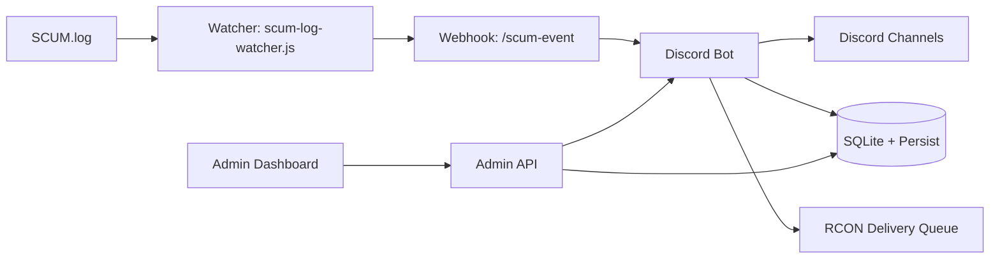

# SCUM TH Bot
Discord + SCUM Server Operations Platform


README นี้เป็นเอกสารหลักสำหรับติดตั้ง/ใช้งาน/ขึ้น production ของโปรเจกต์นี้  
เอกสารเสริม:
- สถานะงานเชิงลึกและ changelog: [PROJECT_HQ.md](./PROJECT_HQ.md)
- Incident runbook: [docs/INCIDENT_RESPONSE.md](./docs/INCIDENT_RESPONSE.md)
- Data migration plan: [docs/DATA_LAYER_MIGRATION.md](./docs/DATA_LAYER_MIGRATION.md)

---

## 1) ภาพรวม

ระบบนี้รวมการจัดการ SCUM server ผ่าน Discord ไว้ในจุดเดียว:
- เศรษฐกิจ, ร้านค้า, ตะกร้า, ซื้อสินค้า
- ส่งของอัตโนมัติผ่าน RCON queue + retry + dead-letter + audit
- Ticket/Event/Bounty/Giveaway/VIP/Redeem
- Kill feed, stats, top boards, weapon/distance/hit-zone
- SCUM log watcher -> webhook -> bot
- Admin Web (RBAC, 2FA/SSO optional, backup/restore, observability)

---

## 2) สถานะล่าสุด

- Automated checks: ผ่าน
  - `npm run check` ผ่าน (`29/29`)
  - `npm run security:check` ผ่าน
  - `npm run doctor` ผ่าน
  - `npm audit --omit=dev` ไม่พบ vulnerability
- ระบบหลักพร้อมใช้งานจริง โดยมี checklist production ชัดเจน
- งานค้างหลักที่ต้องทำเองก่อนเปิดจริง:
  - หมุน `DISCORD_TOKEN` ใหม่จาก Discord Developer Portal
  - ตรวจ/ยืนยันค่า production env ทั้งชุด

---

## 3) ความสามารถหลัก

| หมวด | สถานะ | รายละเอียด |
|---|---|---|
| Economy + Wallet | พร้อม | `daily/weekly`, set/add/remove, transfer/gift |
| Shop + Cart + Purchase | พร้อม | ซื้อเดี่ยว/หลายชิ้น, inventory, purchase log |
| RCON Auto Delivery | พร้อม | queue, retry/backoff, dead-letter retry/remove, idempotency, watchdog |
| Rent Bike Daily | พร้อม | 1 ครั้ง/วัน/คน, queue-safe, reset/cleanup รอบวัน |
| Ticket/Event/Bounty | พร้อม | ticket claim/close + ลบห้องอัตโนมัติ |
| Stats + Kill Feed | พร้อม | รองรับ weapon, distance, hit zone |
| Admin Web | พร้อม | login จาก DB, RBAC, backup/restore, live updates |
| Observability | พร้อม | metrics + alerts + `/healthz` |

---

## 4) Architecture



---

## 5) ติดตั้งและเริ่มระบบ

### 5.1 Prerequisites

- Node.js 20+
- Discord application + bot token
- เข้าถึงไฟล์ `SCUM.log`
- SQLite CLI (`sqlite3`) อยู่ใน PATH

หมายเหตุ: persistence layer ใน [src/store/_persist.js](./src/store/_persist.js) เรียก `sqlite3` binary โดยตรง

### 5.2 Install

```bash
npm install
copy .env.example .env
```

### 5.3 Register slash commands

```bash
npm run register-commands
```

### 5.4 Start services

Terminal 1:

```bash
npm start
```

Terminal 2:

```bash
node scum-log-watcher.js
```

Admin web:

```text
http://127.0.0.1:3200/admin/login
```

---

## 6) Environment สำคัญ

### 6.1 Required ขั้นต่ำ

| Key | Required | หมายเหตุ |
|---|---|---|
| `DISCORD_TOKEN` | Yes | Token บอท |
| `DISCORD_CLIENT_ID` | Yes | สำหรับ register commands |
| `DISCORD_GUILD_ID` | Yes | Guild เป้าหมาย |
| `SCUM_LOG_PATH` | Yes (watcher) | Path ไป `SCUM.log` |
| `SCUM_WEBHOOK_SECRET` | Yes | Secret ระหว่าง watcher -> bot |
| `DATABASE_URL` | Yes | เช่น `file:./prisma/dev.db` |

### 6.2 Admin login (DB-based)

ระบบ login ใช้ตาราง `admin_web_users` เป็นหลัก
- bootstrap ครั้งแรกจาก `ADMIN_WEB_USERS_JSON`
- ถ้าไม่ตั้ง JSON จะใช้ `ADMIN_WEB_USER` + `ADMIN_WEB_PASSWORD`
- ถ้า `ADMIN_WEB_PASSWORD` ว่าง จะ fallback ไป `ADMIN_WEB_TOKEN` (ไม่แนะนำสำหรับ production)

---

## 7) Production Checklist

### 7.1 Security (ห้ามข้าม)

1. หมุน secrets ทั้งหมดก่อนเปิดจริง  
   `DISCORD_TOKEN`, `SCUM_WEBHOOK_SECRET`, `ADMIN_WEB_PASSWORD`, `ADMIN_WEB_TOKEN`, `RCON_PASSWORD`
2. ตั้ง `NODE_ENV=production`
3. บังคับค่า:
   - `ADMIN_WEB_SECURE_COOKIE=true`
   - `ADMIN_WEB_HSTS_ENABLED=true`
   - `ADMIN_WEB_ALLOW_TOKEN_QUERY=false`
   - `ADMIN_WEB_ENFORCE_ORIGIN_CHECK=true`
   - `ADMIN_WEB_ALLOWED_ORIGINS=https://admin.your-domain.com`
4. อย่า expose admin port ตรง internet, ให้วางหลัง HTTPS reverse proxy

### 7.2 Persistence/Data

1. ติดตั้ง `sqlite3` binary ในเครื่อง production
2. ยืนยัน path DB อยู่บน disk ถาวร
3. หลัง migration data layer ครบ ให้ตั้ง `PERSIST_REQUIRE_DB=true`

### 7.3 Runtime/Process

1. รันแบบ single instance ต่อ service (bot 1, watcher 1)
2. ใช้ process manager (PM2/NSSM/Systemd)
3. เช็กว่า port ไม่ชน (`3100`, `3200` หรือพอร์ตที่คุณตั้ง)
4. เปิด health check ที่ `GET /healthz`

---

## 8) Validation ก่อน Deploy

```bash
npm run check
npm run security:check
npm run doctor
npm audit --omit=dev
```

Expected:
- Tests ผ่านทั้งหมด
- Security check ผ่าน
- No known npm vulnerabilities

---

## 9) Test Coverage ปัจจุบัน

ชุดเทสต์ครอบคลุมหลักๆ:
- Admin API auth/validation + RBAC
- Admin live updates + ticket full flow
- Discord interaction flow (slash/button/modal)
- Purchase -> queue -> auto-delivery success
- Dead-letter retry/remove + idempotency
- Rent bike e2e (rent -> limit -> reset -> cleanup)
- Watcher parse หลายรูปแบบ
- Webhook auth + malformed JSON + oversized payload
- Persistence fallback/required-db behavior

---

## 10) Troubleshooting

### `Missing Permissions` ตอนสร้าง ticket

บอทต้องมีสิทธิ์ในหมวด/ช่อง:
- ViewChannel
- SendMessages
- ManageChannels
- ManageRoles

### `Unknown interaction (10062)` / `already acknowledged (40060)`

- คำสั่งตอบช้าเกินเวลา หรือ reply/defer ซ้ำ
- ใช้ `deferReply` กับงานที่ใช้เวลานาน

### `SCUM webhook port is already in use`

- มี process ตัวเดิมรันอยู่
- ปิดตัวเดิมหรือเปลี่ยน `SCUM_WEBHOOK_PORT`

### `sqlite3 binary not found`

- ติดตั้ง SQLite CLI และให้ `sqlite3` อยู่ใน PATH
- ถ้า production และตั้ง `PERSIST_REQUIRE_DB=true` ระบบจะ fail-fast ทันที

---

## 11) Ops Notes

- มี `ops-alert` event สำหรับเฝ้าระวัง queue pressure/fail-rate/login spikes
- Backup/restore ใช้ผ่าน Admin API (owner role)
- ควรมี restore drill ก่อนเปิดจริงทุกครั้ง

---

## 12) License

ISC
