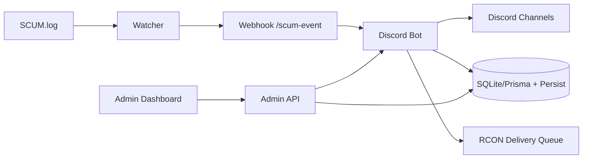

# SCUM TH Bot
Discord + SCUM Server Operations Platform


ระบบบอท Discord สำหรับเซิร์ฟเวอร์ SCUM ที่รวม Economy, Shop, Auto Delivery, Ticket, Admin Web และ Observability ไว้ในโปรเจกต์เดียว

เอกสารสถานะเชิงลึก: [PROJECT_HQ.md](./PROJECT_HQ.md)

---

## ฟีเจอร์หลัก

- Economy + Wallet + Daily/Weekly
- Shop + Cart + Purchase + Inventory
- Auto Delivery ผ่าน RCON queue (retry + dead-letter + audit + watchdog)
- Rent Bike รายวัน (1 ครั้ง/วัน/คน + reset/cleanup)
- Ticket / Event / Bounty / Giveaway / VIP / Redeem
- Kill feed แบบ realtime (weapon + distance + hit-zone)
- Admin Web (RBAC owner/admin/mod, login จาก DB, backup/restore, live updates)
- Player Portal Web แยก (`/player`) สำหรับผู้เล่น (dashboard + shop + inventory + quick actions)
- Observability (metrics time-series, ops alerts, `/healthz`)

---

## สถาปัตยกรรมย่อ



รายละเอียดเชิงลึกของ runtime split/health checks:
- [docs/ARCHITECTURE.md](./docs/ARCHITECTURE.md)

---

## Quick Start

### ติดตั้งแบบง่าย (Windows, แนะนำ)

รันครั้งเดียวที่โฟลเดอร์โปรเจกต์:

```bash
npm run setup:easy
```

หรือดับเบิลคลิกไฟล์ `setup-easy.cmd`

สคริปต์จะทำให้:

- สร้าง `.env` อัตโนมัติจาก `.env.example` ถ้ายังไม่มี
- สร้าง `apps/web-portal-standalone/.env` อัตโนมัติถ้ายังไม่มี
- ติดตั้ง dependencies (`npm install`)
- `prisma generate` + `prisma db push`

### 1) ติดตั้ง

```bash
npm install
copy .env.example .env
```

### 2) ตั้งค่า `.env`

ค่าจำเป็นขั้นต่ำ:

- `DISCORD_TOKEN`
- `DISCORD_CLIENT_ID`
- `DISCORD_GUILD_ID`
- `SCUM_LOG_PATH`
- `SCUM_WEBHOOK_SECRET`
- `DATABASE_URL` (เช่น `file:./prisma/dev.db`)

### ตั้งค่า Auto Spawn จากไฟล์ Wiki/Manifest (ใหม่)

ระบบส่งของรองรับการ map คำสั่งเสกของอัตโนมัติจาก 2 แหล่ง:

- `scum_weapons_from_wiki.json` (อาวุธ + spawn command example)
- `scum_item_category_manifest.json` (ทุกหมวด + spawn format กลาง)

- ถ้ามี `itemCommands` ตรงกับ `itemId` หรือ `gameItemId` ระบบจะใช้ค่านั้นก่อน
- ถ้าไม่เจอ ระบบจะ fallback ไปใช้ `spawn_command_example` จากไฟล์อาวุธ wiki
- ถ้าไม่เจออีก ระบบจะ fallback ไปใช้ template กลางจาก manifest (`#SpawnItem <Item_ID>`)
- ระบบจะแมส `gameItemId/spawn_id` กับ icon จาก `scum_items-main` อัตโนมัติ (ใช้ได้ทั้ง Discord และเว็บ)
- ถ้าต้องการบังคับใช้ไฟล์ไอคอนที่มีในเครื่อง:
  - ตั้ง `SCUM_ITEMS_IGNORE_INDEX_URL=true`
  - ตั้ง `SCUM_ITEMS_BASE_URL` เป็น URL static ของไฟล์จริง เช่น `http://127.0.0.1:3200/assets/scum-items/` หรือโดเมน production ของคุณ
  - ระบบรองรับ route static ไอคอน:
    - Admin web: `/assets/scum-items/<filename>` และ `/admin/assets/scum-items/<filename>`
    - Player portal standalone: `/assets/scum-items/<filename>` และ `/player/assets/scum-items/<filename>`

ปรับพฤติกรรมได้ที่ config:

- `delivery.auto.wikiWeaponCommandFallbackEnabled` (`true`/`false`)
- `delivery.auto.itemManifestCommandFallbackEnabled` (`true`/`false`)

ตรวจรายการจากไฟล์ผ่าน Admin API:

- `GET /admin/api/items/weapons-catalog?q=&limit=200`
- `GET /admin/api/items/manifest-catalog?q=&category=&limit=300`

### 3) ลงทะเบียน slash commands

```bash
npm run register-commands
```

### 4) รันระบบ

Terminal 1:

```bash
npm start
```

Terminal 2:

```bash
node scum-log-watcher.js
```

Admin Web:

- `http://127.0.0.1:3200/admin/login`

### โหมดแยก process (แนะนำ production)

1. Bot process:

```bash
npm run start:bot
```

2. Worker process:

```bash
npm run start:worker
```

3. SCUM watcher:

```bash
node scum-log-watcher.js
```

4. Web portal แยก:

```bash
npm run start:web-standalone
```

ตัวอย่างไฟล์ PM2 สำหรับรันครบชุดอยู่ที่:

- [deploy/pm2.ecosystem.config.cjs](./deploy/pm2.ecosystem.config.cjs)

รันด้วย PM2:

```bash
pm2 start deploy/pm2.ecosystem.config.cjs
pm2 status
pm2 logs scum-bot
```

### โหมด Docker (production-ready)

มีไฟล์พร้อมใช้:

- [Dockerfile](./Dockerfile)
- [deploy/docker-compose.production.yml](./deploy/docker-compose.production.yml)

รัน:

```bash
docker compose -f deploy/docker-compose.production.yml up -d --build
docker compose -f deploy/docker-compose.production.yml ps
```

หยุด:

```bash
docker compose -f deploy/docker-compose.production.yml down
```

Windows helper:

```bat
deploy\docker-up.cmd
deploy\docker-down.cmd
```

### โหมด systemd (Linux)

ไฟล์ unit ตัวอย่าง:

- [scum-bot.service](./deploy/systemd/scum-bot.service)
- [scum-worker.service](./deploy/systemd/scum-worker.service)
- [scum-watcher.service](./deploy/systemd/scum-watcher.service)
- [scum-web-portal.service](./deploy/systemd/scum-web-portal.service)

ติดตั้งอย่างย่อ:

```bash
sudo cp deploy/systemd/*.service /etc/systemd/system/
sudo systemctl daemon-reload
sudo systemctl enable --now scum-bot scum-worker scum-watcher scum-web-portal
sudo systemctl status scum-bot
```

---

## การทดสอบ

รันชุดตรวจทั้งหมด:

```bash
npm run check
npm run security:check
```

รันเฉพาะเทสต์:

```bash
npm test
```

สถานะล่าสุด: `43/43 passing`

เช็กความพร้อมก่อนปล่อยขึ้นจริง:

```bash
npm run readiness:full
npm run readiness:prod
# ถ้าต้องการรวม npm audit ด้วย
npm run readiness:prod:audit
```

---

## สถานะ Data Layer (P2)

ย้ายเป็น Prisma แล้ว:

- `memoryStore` (wallet/shop/purchase)
- `WalletLedger` + `PurchaseStatusHistory`
- `linkStore`
- `bountyStore`
- `statsStore`
- `cartStore`
- `redeemStore`
- `vipStore`
- `scumStore`
- `eventStore`
- `ticketStore`
- `weaponStatsStore`
- `welcomePackStore`
- `moderationStore`
- `giveawayStore`
- `topPanelStore`
- `deliveryAuditStore`
- `playerAccountStore` (`PlayerAccount`)
- `config-overrides` (`BotConfig`)
- `delivery queue` (`DeliveryQueueJob`)
- `delivery dead-letter` (`DeliveryDeadLetter`)

สถานะ production baseline:

- บังคับ fail-fast แล้ว: `NODE_ENV=production` ต้องมี `PERSIST_REQUIRE_DB=true`
- หากฐานข้อมูลใช้งานไม่ได้ ระบบจะไม่ fallback และจะหยุด start ทันที

หมายเหตุ: ตอนนี้ `link/bounty/stats/cart/redeem/vip/scum/event/ticket/weaponStats/welcomePack/moderation/giveaway/topPanel/deliveryAudit` ใช้รูปแบบ `in-memory cache + Prisma write-through + startup hydration` เพื่อไม่ให้ API เดิมพัง

---

## ความคืบหน้า Roadmap (ล่าสุด)

- Phase 1 เสร็จ:
  - Data layer migration ส่วน wallet/purchase/cart/redeem/vip/scum/event/ticket/weaponStats/welcomePack/moderation/giveaway/topPanel/deliveryAudit พร้อม migration ใหม่
  - Wallet ledger ครบ audit trail
  - Order/delivery state machine + transition guard + status history
  - Admin security hardening ฝั่ง purchase status API
- Phase 2 เริ่มแล้ว:
  - Player account system (DB model + store)
  - SteamID binding sync อัตโนมัติจาก link store
  - Player dashboard API: `GET /admin/api/player/dashboard?userId=<discordId>`
  - Player accounts API: `GET /admin/api/player/accounts`
  - Player Portal UI แยกที่ `/player` + API เฉพาะผู้เล่น (`/admin/api/portal/*`)
  - Inventory/catalog query-filter สำหรับ player portal
- Phase 3 เริ่มวางฐาน:
  - Shared coin service กลาง (`src/services/coinService.js`)
  - เพิ่ม `src/services/playerOpsService.js` เป็น service กลางสำหรับ `rentbike` + `bounty` + `redeem`
  - ย้าย flow เหรียญหลัก (`add/remove/set/gift/event/refund`) ให้ผ่าน coin service มากขึ้น
  - เพิ่ม worker entrypoint (`src/worker.js`) + runtime split flags + PM2 manifest

---

## Production Checklist (สรุป)

- หมุน secret ทั้งชุดก่อน deploy
  - `DISCORD_TOKEN`, `SCUM_WEBHOOK_SECRET`, `ADMIN_WEB_PASSWORD`, `ADMIN_WEB_TOKEN`, `RCON_PASSWORD`
  - (อัตโนมัติ) `npm run security:rotate:prod`
  - ใส่ token จริงขณะหมุนได้ด้วย:
    - `node scripts/rotate-production-secrets.js --write --discord-token <token> --portal-discord-secret <secret>`
- ตั้งค่า production security env
  - `NODE_ENV=production`
  - `ADMIN_WEB_SECURE_COOKIE=true`
  - `ADMIN_WEB_HSTS_ENABLED=true`
  - `ADMIN_WEB_ALLOW_TOKEN_QUERY=false`
  - `ADMIN_WEB_ENFORCE_ORIGIN_CHECK=true`
- ถ้าแยก process ตาม Phase 3:
  - Bot: `BOT_ENABLE_ADMIN_WEB=true`, `BOT_ENABLE_RENTBIKE_SERVICE=false`, `BOT_ENABLE_DELIVERY_WORKER=false`
  - Worker: `WORKER_ENABLE_RENTBIKE=true`, `WORKER_ENABLE_DELIVERY=true`
- วาง Admin Web หลัง HTTPS reverse proxy
- รันก่อนปล่อยจริง:
  - `npm run readiness:prod`
  - `npm run smoke:postdeploy`
  - (ตัวเลือกเสริม) `npm run readiness:prod:audit`

สคริปต์ใหม่ที่ใช้บ่อย:

- `npm run readiness:full`
  - ตรวจ lint/test/security/doctor สำหรับ environment ปัจจุบัน
- `npm run readiness:prod`
  - เพิ่ม production doctor ของเว็บ standalone เข้าไปด้วย
- `npm run smoke:postdeploy`
  - ตรวจ endpoint สำคัญหลัง deploy (healthz, login pages, redirects, auth gate)

Windows helper (รันต่อเนื่อง readiness + smoke):

```bat
deploy\run-production-checks.cmd
```

คู่มือ deploy แบบ step-by-step (PM2 + reverse proxy + backup/restore):
- [docs/DEPLOYMENT_STORY.md](./docs/DEPLOYMENT_STORY.md)
- [docs/CUSTOMER_ONBOARDING.md](./docs/CUSTOMER_ONBOARDING.md)

ตัวอย่าง reverse proxy config:
- [deploy/nginx.player-admin.example.conf](./deploy/nginx.player-admin.example.conf)

One-click production (Windows + PM2):

```bat
npm run deploy:oneclick:win
```

หมายเหตุ:
- ถ้า `DISCORD_TOKEN` หรือ `WEB_PORTAL_DISCORD_CLIENT_SECRET` ยังเป็น placeholder ระบบจะหยุดที่ `security:check` เพื่อกัน deploy ผิดค่า

---

## Endpoint สำคัญ

- Admin Web: `GET /admin/login`
- Player Portal: `GET /player`
- Admin Observability: `GET /admin/api/observability`
- Live stream: `GET /admin/api/live`
- Player Dashboard API: `GET /admin/api/player/dashboard?userId=<discordId>`
- Portal API (ผ่าน standalone): `/player/api/dashboard`, `/player/api/shop/list`, `/player/api/purchase/list`, `/player/api/redeem`, `/player/api/rentbike/request`
- Health check: `GET /healthz`
- SCUM webhook: `POST /scum-event`

---

## เว็บแยก (Discord OAuth)

มีโปรเจคเว็บแยกจากบอทเดิมแล้วที่:

- `apps/web-portal-standalone/`

จุดประสงค์:

- login ผ่าน Discord OAuth
- แยก process ออกจากบอทหลัก
- ให้เว็บนี้เป็น `player-only` แบบไม่พึ่ง `/admin/api`
- route `/admin*` จะ redirect ไป admin เดิมตาม `WEB_PORTAL_LEGACY_ADMIN_URL`

รันได้ด้วย:

```bash
npm run start:web-standalone
```

ตรวจความพร้อมก่อน deploy:

```bash
npm run doctor:web-standalone
npm run doctor:web-standalone:prod
```

เช็กรายละเอียดและ checklist production:

- [apps/web-portal-standalone/README.md](./apps/web-portal-standalone/README.md)

คู่มือติดตั้งแบบละเอียด:

- [apps/web-portal-standalone/README.md](./apps/web-portal-standalone/README.md)

---

## เอกสารเพิ่มเติม

- สถานะโครงการ + roadmap + changelog: [PROJECT_HQ.md](./PROJECT_HQ.md)
- Incident runbook: [docs/INCIDENT_RESPONSE.md](./docs/INCIDENT_RESPONSE.md)
- Data migration plan: [docs/DATA_LAYER_MIGRATION.md](./docs/DATA_LAYER_MIGRATION.md)
- Deployment story: [docs/DEPLOYMENT_STORY.md](./docs/DEPLOYMENT_STORY.md)
- Repo presentation checklist: [docs/REPO_PRESENTATION.md](./docs/REPO_PRESENTATION.md)

---

## License

ISC
