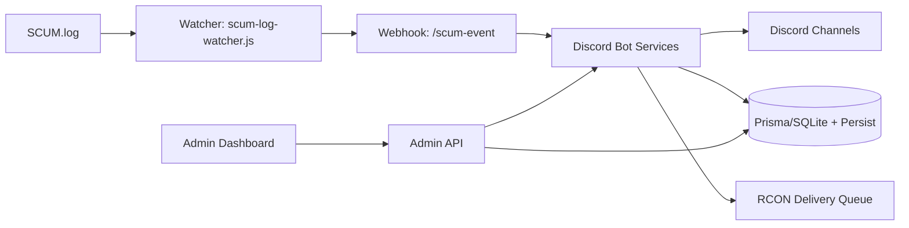

<div align="center">

# SCUM TH Bot
### Discord + SCUM Server Operations Platform


</div>

โปรเจกต์นี้คือระบบจัดการเซิร์ฟ SCUM แบบครบวงจรผ่าน Discord Bot + Admin Web  
รองรับเศรษฐกิจในดิสคอร์ด, ร้านค้า, ตะกร้า, ส่งของอัตโนมัติผ่าน RCON, ทิคเก็ต, สถิติ, ค่าหัว, กิจกรรม, และระบบเช่ามอไซรายวัน

---

## สารบัญ

1. [ภาพรวม](#ภาพรวม)
2. [ความสามารถหลัก](#ความสามารถหลัก)
3. [สถาปัตยกรรมระบบ](#สถาปัตยกรรมระบบ)
4. [ติดตั้งและเริ่มใช้งาน](#ติดตั้งและเริ่มใช้งาน)
5. [ตั้งค่า Environment (.env)](#ตั้งค่า-environment-env)
6. [รันระบบ](#รันระบบ)
7. [คำสั่งที่ใช้บ่อย](#คำสั่งที่ใช้บ่อย)
8. [Admin Web และ Ops](#admin-web-และ-ops)
9. [Security Baseline](#security-baseline)
10. [การทดสอบและคุณภาพโค้ด](#การทดสอบและคุณภาพโค้ด)
11. [Troubleshooting](#troubleshooting)
12. [Roadmap สถานะล่าสุด](#roadmap-สถานะล่าสุด)
13. [โครงสร้างโปรเจกต์](#โครงสร้างโปรเจกต์)
14. [เอกสารเสริม](#เอกสารเสริม)

---

## ภาพรวม

`SCUM TH Bot` ถูกออกแบบให้เป็น "single operations hub" สำหรับแอดมินเซิร์ฟ SCUM:

- จัดการเศรษฐกิจและร้านค้าใน Discord
- เชื่อม SCUM log -> webhook -> kill feed/stat/event อัตโนมัติ
- ส่งของอัตโนมัติผ่าน RCON queue พร้อม retry/audit/dead-letter
- มีหน้าเว็บหลังบ้าน (RBAC + 2FA/SSO + backup/restore + metrics timeline)

---

## ความสามารถหลัก

| หมวด | สถานะ | รายละเอียด |
|---|---|---|
| Economy / Wallet | Production-ready | daily/weekly, set/add/remove, gift/transfer |
| Shop / Purchase / Cart | Production-ready | buy, inventory, purchase log, refund, cart checkout |
| RCON Auto Delivery | Production-ready | queue, retry/backoff, idempotency, dead-letter, watchdog |
| Ticket / Event / Bounty | Production-ready | ticket claim/close+delete channel, event lifecycle, bounty flow |
| Stats / Top / Kill Feed | Production-ready | kill/death/playtime, weapon + distance + hit zone |
| Rent Bike Daily | Production-ready | 1/day quota, queue delivery, midnight cleanup |
| Admin Web | Production-ready | login/session, RBAC owner/admin/mod, live updates |
| Observability | Production-ready | time-series metrics, alerts, `/healthz` |
| Security Hardening | Baseline done | startup guard, origin checks, rate limit, security headers |

---

## สถาปัตยกรรมระบบ



---

## ติดตั้งและเริ่มใช้งาน

### 1) สิ่งที่ต้องมี

- Node.js 20+
- Discord Bot Application + Bot Token
- SCUM server log access (`SCUM.log`)
- SQLite (ใช้ผ่าน Prisma + local DB file)

### 2) ติดตั้ง dependencies

```bash
npm install
```

### 3) เตรียมไฟล์ config

```bash
copy .env.example .env
```

### 4) ลงทะเบียน slash commands

```bash
npm run register-commands
```

---

## ตั้งค่า Environment (.env)

ค่าที่สำคัญที่สุด (ขั้นต่ำ):

| Key | Required | ตัวอย่าง |
|---|---|---|
| `DISCORD_TOKEN` | Yes | token ของบอท |
| `DISCORD_CLIENT_ID` | Yes | app client id |
| `DISCORD_GUILD_ID` | Yes | guild id ที่จะ register command |
| `SCUM_WEBHOOK_SECRET` | Yes | random secret ยาว |
| `SCUM_LOG_PATH` | Yes (watcher) | `D:\\SCUMServer\\SCUM.log` |
| `DATABASE_URL` | Yes | `file:./prisma/dev.db` |
| `PERSIST_REQUIRE_DB` | Recommended (prod) | `true` หลังย้าย data layer |
| `ADMIN_WEB_PASSWORD` | Recommended | รหัสผ่านเข้า admin web |
| `ADMIN_WEB_TOKEN` | Recommended | token fallback/admin API |

หมายเหตุระบบล็อกอินใหม่:
- Admin login ใช้ฐานข้อมูลตาราง `admin_web_users` เป็นหลัก
- ตอนเริ่มระบบครั้งแรก จะ bootstrap ผู้ใช้จาก `ADMIN_WEB_USERS_JSON` หรือ `ADMIN_WEB_USER` + `ADMIN_WEB_PASSWORD` ลง DB อัตโนมัติ
- หลังจากมีผู้ใช้ใน DB แล้ว แนะนำให้จัดการบัญชีผ่าน DB/เครื่องมือแอดมิน และเก็บ env สำหรับ bootstrap เท่านั้น

ตัวอย่างค่าด้านความปลอดภัยสำหรับ production:

```env
NODE_ENV=production
ADMIN_WEB_SECURE_COOKIE=true
ADMIN_WEB_HSTS_ENABLED=true
ADMIN_WEB_ALLOW_TOKEN_QUERY=false
ADMIN_WEB_ENFORCE_ORIGIN_CHECK=true
ADMIN_WEB_ALLOWED_ORIGINS=https://admin.example.com
```

สร้าง secret ชุดใหม่อย่างเร็ว:

```bash
npm run security:generate-secrets
```

---

## รันระบบ

เปิดบอท:

```bash
npm start
```

เปิด watcher (อีก process):

```bash
node scum-log-watcher.js
```

Admin Web:

```text
http://127.0.0.1:3200/admin/login
```

Health endpoint:

```text
GET /healthz
```

---

## คำสั่งที่ใช้บ่อย

### Economy / Shop

- `/balance`
- `/daily`
- `/weekly`
- `/shop`
- `/buy`
- `/inventory`
- `/cart view|add|remove|clear|checkout`
- `/prices`

### Community

- `/ticket`
- `/event`
- `/bounty`
- `/giveaway`
- `/report`
- `/vip`
- `/redeem`

### Stats / Info

- `/stats`
- `/top`
- `/server`
- `/online`

### Admin/Ops

- `/panel`
- `/purchase-log`
- `/mark-delivered`
- `/refund`
- `/panel shop-refresh-buttons limit:<n>`

---

## Admin Web และ Ops

หน้า Admin Web รองรับ:

- คุมเศรษฐกิจและสินค้า
- จัดการคิวส่งของ (`enqueue/retry/cancel/dead-letter retry/delete`)
- จัดการ ticket/event/bounty/moderation
- backup/restore snapshot
- metrics timeline (queue, fail rate, login failures, webhook error rate)
- live updates ผ่าน SSE

RBAC:

- `owner` งานเสี่ยงสูง (restore/reset/set-full-config)
- `admin` งานจัดการทั่วไป
- `mod` งานปฏิบัติการรายวัน

---

## Security Baseline

สิ่งที่มีแล้ว:

- startup guard สำหรับ `NODE_ENV=production`
- session auth + token fallback (timing-safe compare)
- CSP/security headers/origin check/body size limit
- login rate limit + login spike detection
- webhook secret validation + payload limit + timeout
- dead-letter/audit สำหรับ watcher และ delivery queue
- DB fail-fast guard ผ่าน `PERSIST_REQUIRE_DB=true` (ป้องกัน fallback JSON โดยไม่ตั้งใจใน production)

สิ่งที่ยังต้องทำก่อนขึ้นจริง 100%:

1. หมุน `DISCORD_TOKEN` จริงใน Discord Developer Portal
2. ตรวจ `.env` ว่าไม่ถูก track ใน git
3. ทำ incident drill ตาม [docs/INCIDENT_RESPONSE.md](./docs/INCIDENT_RESPONSE.md)

---

## การทดสอบและคุณภาพโค้ด

คำสั่งมาตรฐาน:

```bash
npm run lint
npm test
npm run check
npm run security:check
```

สถานะล่าสุด:

- `lint` ผ่าน
- `test` ผ่าน 27/27
- `security:check` ผ่าน

ชุดเทสต์สำคัญที่มีแล้ว:

- admin API auth/validation + backup/restore drill
- admin RBAC matrix
- admin live update + ticket full flow e2e
- rentbike full flow e2e (rent -> delivered -> limit -> reset -> cleanup)
- RCON delivery integration (bundle + idempotency + dead-letter)
- watcher parse multi-format
- webhook auth/dispatch

---

## Troubleshooting

### 1) `DiscordAPIError[50013]: Missing Permissions`

บอทยังไม่มีสิทธิ์พอใน guild/category นั้น  
ให้ตรวจ role permission อย่างน้อย:

- ViewChannel
- SendMessages
- ManageChannels
- ManageRoles

### 2) `DiscordAPIError[10062]: Unknown interaction`

เกิดจากตอบ interaction ช้าเกินเวลา หรือ reply ซ้ำ  
แนวทาง:

- ใช้ `deferReply` ถ้างานใช้เวลานาน
- ตรวจ flow ว่า `reply/followUp/editReply` ถูกจุด

### 3) ปุ่มเก่ากดแล้ว flow ไม่ตรง

ให้รีเฟรชโพสต์ร้านค้าเก่า:

```text
/panel shop-refresh-buttons limit:50
```

### 4) Admin login 401

ตรวจ `.env`:

- `ADMIN_WEB_USER`
- `ADMIN_WEB_PASSWORD`
- `ADMIN_WEB_TOKEN`

และดูว่า browser ส่ง cookie กลับมาปกติหรือไม่

### 5) RCON ไม่ส่งของ

ตรวจค่า:

- `RCON_EXEC_TEMPLATE`
- `RCON_HOST`, `RCON_PORT`, `RCON_PASSWORD`
- config `delivery.auto.itemCommands`

---

## Roadmap สถานะล่าสุด

### ปิดแล้ว

- RBAC owner/admin/mod
- backup/restore ผ่าน admin web
- metrics timeline + filter + health endpoint
- dead-letter retry + idempotency + queue watchdog
- e2e rentbike full flow
- e2e Discord interaction full flow (slash/button/modal)
- persistence mode observability + `PERSIST_REQUIRE_DB` fail-fast + fallback/required tests

### คงค้าง

1. หมุน `DISCORD_TOKEN` จริงใน production
2. ย้าย data layer ที่ยังเป็น JSON ไป Prisma ต่อเนื่อง (P2) แล้วตั้ง `PERSIST_REQUIRE_DB=true` ใน production

รายละเอียดเชิงลึกและ changelog เต็มดูที่ [PROJECT_HQ.md](./PROJECT_HQ.md)

---

## โครงสร้างโปรเจกต์

```text
src/
  admin/                  # dashboard + login UI
  commands/               # slash commands
  services/               # delivery, rentbike, events, live bus
  store/                  # persistence layer
  bot.js                  # main bot runtime
  adminWebServer.js       # admin API server
  scumWebhookServer.js    # webhook receiver
scum-log-watcher.js       # SCUM log tailer
test/                     # integration/e2e tests
scripts/                  # ops scripts (security checks, helpers)
```

---

## เอกสารเสริม

- Project status / changelog / roadmap: [PROJECT_HQ.md](./PROJECT_HQ.md)
- Incident response runbook: [docs/INCIDENT_RESPONSE.md](./docs/INCIDENT_RESPONSE.md)
- Environment template: [.env.example](./.env.example)

---

## License

ISC
