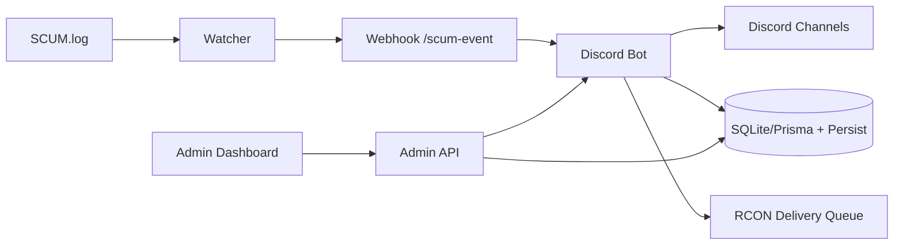

# SCUM TH Bot
Discord + SCUM Server Operations Platform


ระบบบอท Discord สำหรับเซิร์ฟเวอร์ SCUM ที่รวม Economy, Shop, Auto Delivery, Ticket, Admin Web และ Observability ไว้ในโปรเจกต์เดียว

เอกสารสถานะเชิงลึก: [PROJECT_HQ.md](./PROJECT_HQ.md)

---

## ฟีเจอร์หลัก

- Economy + Wallet + Daily/Weekly
- Shop + Cart + Purchase + Inventory
- Auto Delivery ผ่าน RCON queue (retry + dead-letter + audit + watchdog)
- Rent Bike รายวัน (1 ครั้ง/วัน/คน + reset/cleanup)
- Ticket / Event / Bounty / Giveaway / VIP / Redeem
- Kill feed แบบ realtime (weapon + distance + hit-zone)
- Admin Web (RBAC owner/admin/mod, login จาก DB, backup/restore, live updates)
- Observability (metrics time-series, ops alerts, `/healthz`)

---

## สถาปัตยกรรมย่อ



---

## Quick Start

### 1) ติดตั้ง

```bash
npm install
copy .env.example .env
```

### 2) ตั้งค่า `.env`

ค่าจำเป็นขั้นต่ำ:

- `DISCORD_TOKEN`
- `DISCORD_CLIENT_ID`
- `DISCORD_GUILD_ID`
- `SCUM_LOG_PATH`
- `SCUM_WEBHOOK_SECRET`
- `DATABASE_URL` (เช่น `file:./prisma/dev.db`)

### 3) ลงทะเบียน slash commands

```bash
npm run register-commands
```

### 4) รันระบบ

Terminal 1:

```bash
npm start
```

Terminal 2:

```bash
node scum-log-watcher.js
```

Admin Web:

- `http://127.0.0.1:3200/admin/login`

---

## การทดสอบ

รันชุดตรวจทั้งหมด:

```bash
npm run check
npm run security:check
```

รันเฉพาะเทสต์:

```bash
npm test
```

สถานะล่าสุด: `29/29 passing`

---

## สถานะ Data Layer (P2)

ย้ายเป็น Prisma แล้ว:

- `memoryStore` (wallet/shop/purchase)
- `linkStore`
- `bountyStore`
- `statsStore`

ยังค้างสำหรับ migration เพิ่มเติม:

- store อื่นที่ยังใช้ persist JSON/kv fallback
- ปิด fallback ใน production หลัง migration ครบ (`PERSIST_REQUIRE_DB=true`)

หมายเหตุ: ตอนนี้ `link/bounty/stats` ใช้รูปแบบ `in-memory cache + Prisma write-through + startup hydration` เพื่อไม่ให้ API เดิมพัง

---

## Production Checklist (สรุป)

- หมุน secret ทั้งชุดก่อน deploy
  - `DISCORD_TOKEN`, `SCUM_WEBHOOK_SECRET`, `ADMIN_WEB_PASSWORD`, `ADMIN_WEB_TOKEN`, `RCON_PASSWORD`
- ตั้งค่า production security env
  - `NODE_ENV=production`
  - `ADMIN_WEB_SECURE_COOKIE=true`
  - `ADMIN_WEB_HSTS_ENABLED=true`
  - `ADMIN_WEB_ALLOW_TOKEN_QUERY=false`
  - `ADMIN_WEB_ENFORCE_ORIGIN_CHECK=true`
- วาง Admin Web หลัง HTTPS reverse proxy
- รันก่อนปล่อยจริง:
  - `npm run check`
  - `npm run security:check`
  - `npm audit --omit=dev`

---

## Endpoint สำคัญ

- Admin Web: `GET /admin/login`
- Admin Observability: `GET /admin/api/observability`
- Live stream: `GET /admin/api/live`
- Health check: `GET /healthz`
- SCUM webhook: `POST /scum-event`

---

## เอกสารเพิ่มเติม

- สถานะโครงการ + roadmap + changelog: [PROJECT_HQ.md](./PROJECT_HQ.md)
- Incident runbook: [docs/INCIDENT_RESPONSE.md](./docs/INCIDENT_RESPONSE.md)
- Data migration plan: [docs/DATA_LAYER_MIGRATION.md](./docs/DATA_LAYER_MIGRATION.md)

---

## License

ISC
