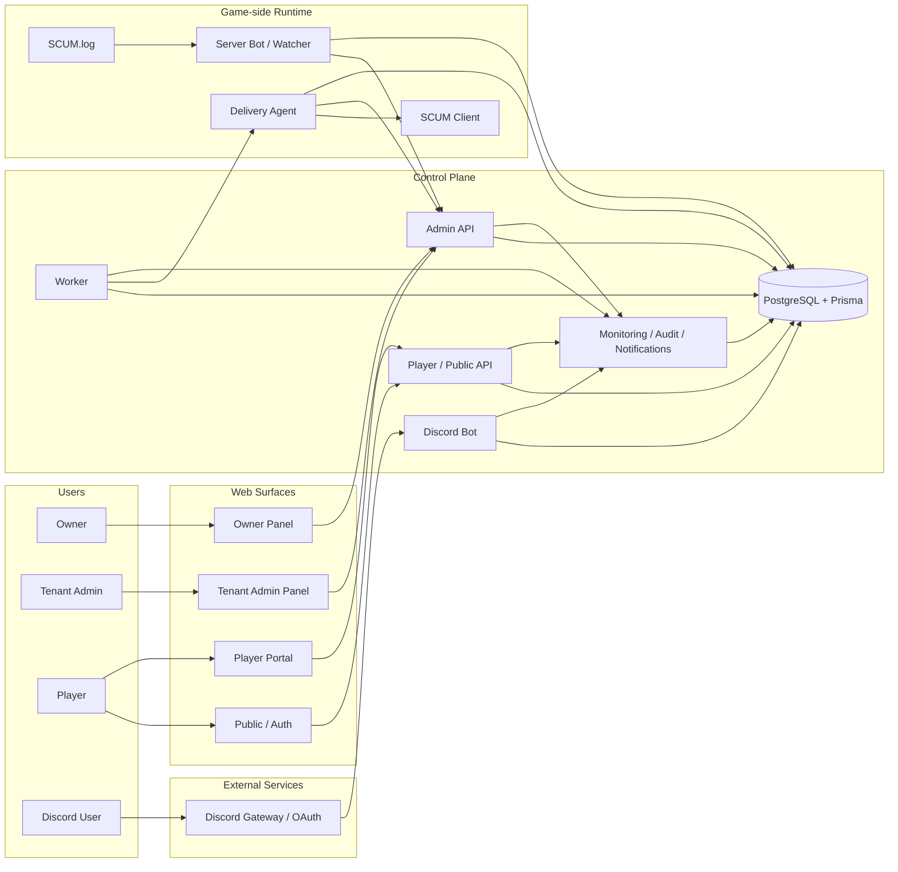
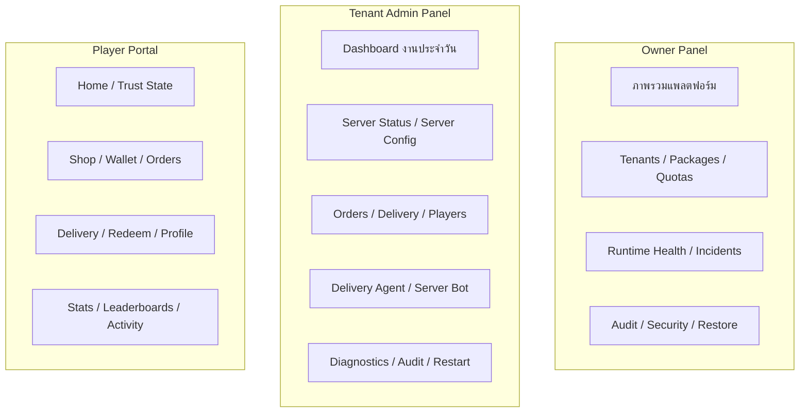
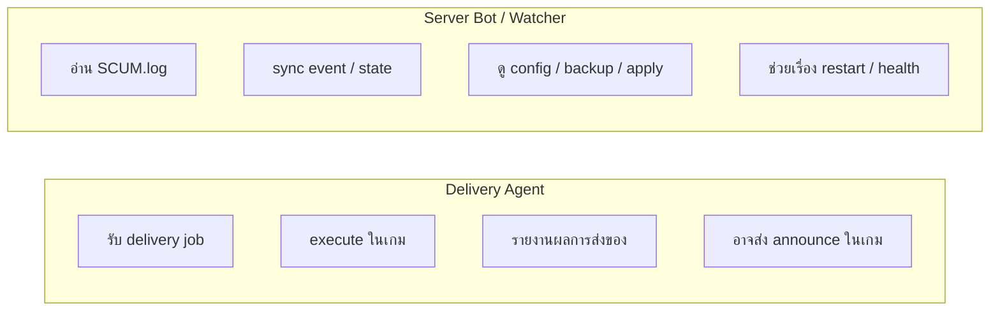

# แผนภาพระบบสำหรับดูบน GitHub

Language:

- English: [SYSTEM_MAP_GITHUB_EN.md](./SYSTEM_MAP_GITHUB_EN.md)
- Thai: `SYSTEM_MAP_GITHUB_TH.md`

อัปเดตล่าสุด: **2026-03-27**

เอกสารนี้ทำไว้สำหรับการอ่านบน GitHub โดยตรง และใช้ Mermaid ที่ GitHub render ได้จริง

เป้าหมายคือ:

- ให้เห็นภาพรวมระบบในหน้าเดียว
- แยก web surface, control plane, และ game-side runtime ให้ชัด
- ใช้เป็นแผนที่นำทางก่อนลงไปอ่านไฟล์เชิงลึกใน `src/`, `apps/`, และ `docs/`

## 1. ภาพรวมทั้งแพลตฟอร์ม

สรุปสั้น:

- ฝั่ง web มี 3 surface หลักคือ Owner, Tenant Admin, และ Player/Public
- control plane กลางพึ่ง `PostgreSQL + Prisma`
- game-side runtime ถูกแยกเป็น `Server Bot / Watcher` กับ `Delivery Agent`
- `Delivery Agent` กับ `Server Bot` ไม่ควรถูกอธิบายว่าเป็น runtime เดียวกัน

## 2. การแยกบทบาทของเว็บทั้ง 3 ฝั่ง

สรุปสั้น:

- `Owner Panel` เน้นการคุมแพลตฟอร์มและ tenant fleet
- `Tenant Admin Panel` เน้นการดูแลเซิร์ฟเวอร์, order, runtime, และ diagnostics ของ tenant
- `Player Portal` เน้นประสบการณ์ผู้เล่น เช่น wallet, shop, orders, delivery, และ profile

## 3. เส้นแบ่งระหว่าง Delivery Agent และ Server Bot

ข้อสำคัญ:

- `Delivery Agent` ต้องอยู่บนเครื่องที่เปิด SCUM client
- `Server Bot` อยู่ฝั่งเครื่องเซิร์ฟเวอร์และดูเรื่อง log/config/control
- ถ้าระบบอธิบายสองตัวนี้ปนกัน จะทำให้ deployment และ troubleshooting ผิดทิศได้ง่าย

## 4. ควรอ่านอะไรต่อ

- [ARCHITECTURE.md](./ARCHITECTURE.md)
- [ARCHITECTURE_TH.md](./ARCHITECTURE_TH.md)
- [RUNTIME_TOPOLOGY.md](./RUNTIME_TOPOLOGY.md)
- [RUNTIME_TOPOLOGY_TH.md](./RUNTIME_TOPOLOGY_TH.md)
- [PRODUCT_READY_GAP_MATRIX.md](./PRODUCT_READY_GAP_MATRIX.md)
- [PRODUCT_READY_GAP_MATRIX_TH.md](./PRODUCT_READY_GAP_MATRIX_TH.md)

ถ้าต้องการข้อความ canonical ให้ยึดเวอร์ชันอังกฤษประกอบด้วย และใช้ไฟล์นี้เป็นแผนที่ภาษาไทยสำหรับคนที่เปิดอ่านจาก GitHub ก่อน
